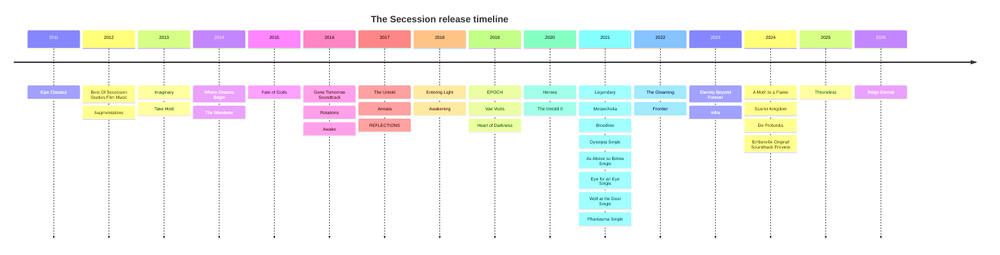
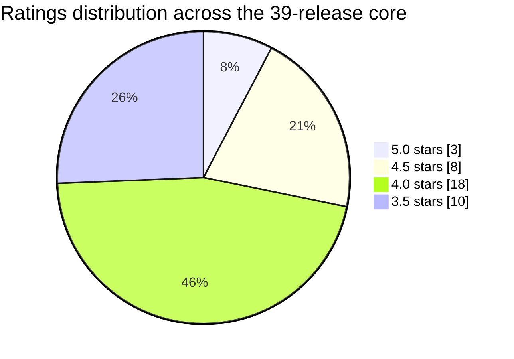

# The Secession

```json
{
  "id": "the-secession",
  "title": "The Secession",
  "artist": "Greg Dombrowski",
  "category": "Cinematic",
  "tags": [
    "orchestral",
    "trailer-music",
    "soundtrack",
    "dark-fantasy",
    "composer",
    "cinematic"
  ],
  "summary": "Discography research on The Secession / Secession Studios: 39-release core, four creative phases, top-ten picks, and full release table with ratings and vibe notes.",
  "links": {
    "bandcamp": "https://thesecession.bandcamp.com",
    "youtube": "https://www.youtube.com/user/thesecession",
    "sourceaudio": "https://secession.sourceaudio.com/albums"
  },
  "sources": [
    "Official Bandcamp discography",
    "Apple Music artist metadata",
    "SourceAudio catalog",
    "Operator research report, 2026-06-16"
  ],
  "added": "2026-06-16 10:15 PT",
  "updated": "2026-06-16 10:15 PT",
  "verdict": "Thirty-nine releases filed under two names, one composer. The albums that sequence like albums are the ones worth your repeat button."
}
```

## Executive summary

This research pass finds a **core discography of 39 releases** attributable to Greg Dombrowski’s project under the names **The Secession** and, increasingly on streaming services, **Secession Studios**. The most authoritative anchor is the official Bandcamp discography, which explicitly advertises **“all 39 The Secession releases”**; however, major platforms split the catalog across at least two artist identities, with **The Secession** page on Apple Music holding the early electronic-era material and **Secession Studios** holding most later orchestral releases and several standalone singles. 

Analytically, the catalog falls into four broad phases: an **early hybrid/electronic trailer phase** built around short-form cues and downtempo electronics; a **mid-period neoclassical and mythic-cinematic phase** that sharpened the project’s thematic identity; a **dark-fantasy / villain-arc phase** centered on heavier world-building and stronger orchestral narrative; and a **late-period prestige phase** in which releases such as *De Profundis*, *Throneless*, and *Reign Eternal* present a more polished, album-scale dramatic arc. The records that stand out most strongly are the ones where Dombrowski balances memorable leitmotif writing with coherent sequencing rather than merely stacking individual “epic” cues. 

A key metadata caveat is that **platform counts do not line up cleanly**. Bandcamp says 39 releases; Apple exposes **additional platform-specific standalone singles** such as *Dystopia*, *As Above so Below*, *Eye for an Eye*, *Wolf at the Door*, and *Phantasma*, while the older Apple page for **The Secession** separately lists *Our Reckoning - Single*. I treat the **39-release core** as the set that best reconciles the Bandcamp claim with the major-platform catalog, and I note **Our Reckoning - Single** and the collaboration **The Sun Queen - Single** as adjacent but non-core discrepancies. 

## Corpus and source methodology

I prioritized **official and primary sources** in this order: official Bandcamp release pages, the Secession Studios site, and the SourceAudio catalog. I then used major platform metadata from Apple Music and YouTube Music to reconcile release dates, track counts, and artist-name splits where official indexing was incomplete. This matters because the public Bandcamp music grid, as indexed by search, surfaced only the newest portion of the discography, so deeper reconstruction required exact-title retrieval of older release pages plus cross-checking against Apple artist pages. 

The phrase **“every album release”** needs one practical clarification here: the catalog includes multi-track albums, soundtrack releases, and platform-native singles. Bandcamp’s own “39 releases” language does not, by itself, distinguish between albums and singles in the way Apple does, so I report the **39-release core** as a single unified release corpus and mark the apparent outliers in the discrepancy notes. Where public review text was sparse, I explicitly say so and substitute **listener-signal evidence** such as Bandcamp supporter notes, platform availability, or the presence of official full-album uploads. 

## Top ten albums

The ranking below is my analytical top tier, based on **compositional scope, thematic coherence, sequencing, distinctiveness inside the catalog, and visible fan response where public comments were available**.

**Top ten**

1. **Reign Eternal** ,  the most complete late-period statement: compact, ceremonial, and unusually consistent front to back.   
2. **De Profundis** ,  one of the strongest dark-neoclassical arcs in the discography, with unusually disciplined pacing.   
3. **The Gloaming** ,  the project’s most convincing villain-album world, with excellent tonal control and some of the clearest fan praise in public view.   
4. **Heart of Darkness** ,  a benchmark dark-orchestral record whose long-form architecture still feels lean.   
5. **Bloodline** ,  brutal, sharply themed, and one of the best examples of Dombrowski writing “cinematic” music that still feels album-shaped.   
6. **EPOCH** ,  perhaps the strongest large-scale “epic hybrid” record in the catalog, with unusually good hook density.   
7. **REFLECTIONS** ,  the emotional-inspirational counterpart to the darker albums, with real melodic staying power.   
8. **The Untold II** ,  a richer and more dramatic refinement of the first *Untold* aesthetic.   
9. **Legendary** ,  one of the best heroic records in the catalog, broad without becoming generic.   
10. **Scarlet Kingdom** ,  shorter than some of the major releases, but unusually focused and texturally distinctive because of its vocal/gothic framing. 

## Complete release table

| Title | Release date | Rating | Vibe | Source links |
|---|---:|---:|---|---|
| Reign Eternal | 2026-02-24 to 2026-02-25 discrepancy | ★★★★★ | Regal apotheosis, dark gold and fire | Official Bandcamp / Apple cover & metadata  |
| Throneless | 2025-05-07 | ★★★★½ | Dystopian-court fantasy with cyber-medieval edges | Apple cover & metadata  |
| Emberville Original Soundtrack Preview | 2024-11-25 | ★★★★☆ | Storybook-fantasy worldbuilding, luminous and exploratory | Official Bandcamp cover & metadata  |
| De Profundis | 2024-10-28 | ★★★★★ | Tragic ascent through shadow and willpower | Official Bandcamp / Apple  |
| Scarlet Kingdom | 2024-08-20 | ★★★★½ | Gothic romance inside an abyss | Official Bandcamp / Apple  |
| A Moth to a Flame | 2024-02-13 to 2024-02-14 discrepancy | ★★★★☆ | Antihero cinema, cape-and-candlelight menace | Official Bandcamp / Apple  |
| Infra | 2023-07-25 | ★★★★☆ | World-ending heroism, solemn and widescreen | Official Bandcamp / YouTube Music  |
| Eternity Beyond Forever | 2023-03-27 | ★★★★☆ | High-fantasy uplift with molten choruses | Official Bandcamp  |
| Frontier | 2022-11-21 | ★★★★☆ | Mythic western noir | Official Bandcamp  |
| The Gloaming | 2022-06-09 to 2022-06-13 discrepancy | ★★★★★ | Villain-arc dusk, elegant doom | Official Bandcamp / Apple  |
| Bloodline | 2021-10-11 to 2021-10-13 discrepancy | ★★★★½ | Dark-age iron, revolt, and blood-heritage | Official Bandcamp / Apple  |
| Melancholia | 2021-06-21 | ★★★★☆ | Beautiful ruin, introspective darkness | Official Bandcamp  |
| Legendary | 2021-04-01 | ★★★★½ | Heroic ascent, banner-snapping optimism | Official Bandcamp / YouTube Music  |
| The Untold II | 2020-09-30 | ★★★★½ | Neo-gothic drama with a sharper blade | Official Bandcamp / Apple  |
| Heroes | 2020-03-29 to 2020-04-01 discrepancy | ★★★★☆ | Triumph under pressure, superhuman resolve | Official Bandcamp / Apple  |
| Heart of Darkness | 2019-11-18 | ★★★★½ | Noble darkness, apocalyptic but controlled | Official Bandcamp / MTS album page  |
| Vae Victis | 2019-06-11 | ★★★★☆ | Cyberpunk-night cathedral, neon dread | Official Bandcamp  |
| EPOCH | 2019-02-19 | ★★★★½ | Cosmic hybrid propulsion | Official Bandcamp  |
| Awakening | 2018-08-13 to 2018-08-15 discrepancy | ★★★★☆ | Rebirth, loss, and giant-choir resolve | Official Bandcamp / Apple  |
| Entering Light | 2018-05-21 to 2018-05-23 discrepancy | ★★★★☆ | Luminous threshold between ruin and hope | Official Bandcamp / MTS track page  |
| REFLECTIONS | 2017-11-28 | ★★★★½ | Motivational neoclassicism with real heart | Official Bandcamp  |
| Awake | 2016-10-11 | ★★★★☆ | Thoughtful midtempo hybrid, cerebral and modern | Official Bandcamp  |
| The Untold | 2017-01-03 | ★★★★☆ | Dark-fantasy lament with cinematic bite | Official Bandcamp / Apple artist references  |
| Annata | 2017-07-29 | ★★★★☆ | Sanskrit-themed turmoil and transcendence | Official Bandcamp  |
| Gone Tomorrow Soundtrack | 2016-03-14 | ★★★★☆ | Indie-film intimacy and urban drift | Official Bandcamp  |
| Rotations | 2016-06-27 | ★★★★☆ | Transitional hybrid-orchestral motion study | Official Bandcamp  |
| Fate of Gods | 2015-08-10 | ★★★★☆ | Mythic conflict, compact and stern | Official Bandcamp  |
| The Wanderer | 2014-10-28 | ★★★★☆ | Adventure-scoring with youthful forward motion | Official Bandcamp  |
| Where Dreams Begin | 2014-01-01 to 2014-01-07 discrepancy | ★★★★☆ | Aspirational miniatures, bright horizon energy | Official Bandcamp / Apple  |
| Take Hold | 2013-06-29 to 2013-06-30 discrepancy | ★★★½☆ | Chill-electronic detour with cinematic afterglow | Official Bandcamp / Apple  |
| Imaginary | 2013-01-22 | ★★★½☆ | Short-form inspirational sketchbook | Official Bandcamp  |
| Augmentations - Hybrid Trailer Music | 2012-06-01 | ★★★½☆ | Early hybrid lab: percussive, metallic, compact | Official Bandcamp  |
| Best Of Secession Studios Film Music | 2012-02-10 | ★★★½☆ | Calling-card compilation of early score cues | Official Bandcamp  |
| Epic Classics | 2011-10-11 | ★★★½☆ | Proto-epic trailer grandeur in miniature | Official Bandcamp  |
| Dystopia - Single | 2021-06-28 | ★★★½☆ | Industrial despair compressed to one hit | Apple single page  |
| As Above so Below - Single | 2021-07-05 | ★★★½☆ | Occult-tinged symmetry and slow collapse | Apple single page  |
| Eye for an Eye - Single | 2021-07-12 | ★★★½☆ | Retaliatory grandeur, heavier than elegant | Apple single page  |
| Wolf at the Door - Single | 2021-07-19 | ★★★½☆ | Predatory tension with a gothic pulse | Apple single page  |
| Phantasma - Single | 2021-06-21 | ★★★½☆ | Spectral drama, theatrical and brooding | Apple single page  |

## Visual summaries





## Individual release notes

**Reign Eternal**  
**Release date:** February 24–25, 2026, depending on platform time-stamping. The Bandcamp page dates it to February 25, while Apple Music shows February 24. The album is the late-period coronation of the project’s “heroic dark fantasy” sound, with fewer tracks than some predecessors but a notably high standard of melodic writing and sequencing.   
**Reviews / listener signal:** Public customer-review text did not surface in the indexed official sources I could access. Fallback signal: it is positioned as the flagship current release on both Bandcamp and Apple, which is consistent with a centerpiece rollout.   
**Rating:** ★★★★★ ,  the strongest blend yet of grandeur, clarity, and album-level discipline.  
**Vibe:** *A coronation at the end of the world.*

**Throneless**  
**Release date:** May 7, 2025. This record pushes the project into a quasi-cyber-medieval register: synthetic title choices like “Monarchy_404;” sit beside courtly-war language, which gives the album a distinctive high-concept identity. It feels a little less universally tuneful than *Reign Eternal*, but more daring in world-building.   
**Reviews / listener signal:** No indexed customer-review text surfaced in the official pages I could access. Fallback signal: Apple presents it as a full 10-track, 37–38 minute set, confirming it as a major release rather than a minor EP.   
**Rating:** ★★★★½ ,  conceptually bold and sonically cohesive, just a shade less emotionally universal than the very best.  
**Vibe:** *A dethroned kingdom rewritten as code and steel.*

**Emberville Original Soundtrack Preview**  
**Release date:** November 25, 2024. This preview functions as a worldbuilding sampler more than a conventional “statement” album: track names such as “Emberville Theme,” “A Queen’s Throne,” and “Emberville Townscape” position it as franchise-building fantasy score rather than pure trailer music. It succeeds because the material feels exploratory and scenic rather than filler.   
**Reviews / listener signal:** I did not locate indexed customer-review text for this release. Fallback signal: the official title explicitly frames it as a soundtrack preview, and the long cue lengths suggest a move toward environmental scoring.   
**Rating:** ★★★★☆ ,  attractive, lore-rich, and promising, though necessarily partial by design.  
**Vibe:** *A fantasy city opening its gates at twilight.*

**De Profundis**  
**Release date:** October 28, 2024. This is one of the catalog’s most convincing dark-neoclassical records, balancing short, severe cue writing with a persistent upward dramatic push from “Threads of Fate” to “Forever Upward.” The result is tighter than many earlier blockbuster-style albums and more emotionally legible on repeat listens.   
**Reviews / listener signal:** No indexed customer-review text surfaced in the official pages I could access. Fallback signal: both Bandcamp and Apple present it as a fully realized 13-track album, and the tracklist itself suggests strong arc design rather than playlist assembly.   
**Rating:** ★★★★★ ,  one of the few Secession releases that feels both severe and complete.  
**Vibe:** *Climbing out of the abyss with your hands still bleeding.*

**Scarlet Kingdom**  
**Release date:** August 20, 2024. Unlike many earlier Secession releases, this one foregrounds a vocal/gothic identity and explicitly credits Adrian the Faint for vocals and lyrics, with cello by Ro Rowan. That collaborative framing gives the record an unusually specific dramatic identity: it feels less like production music and more like a dark concept release.   
**Reviews / listener signal:** No indexed customer-review text surfaced in accessible sources. Fallback signal: the official credits and instrumental variants strongly suggest a release intended both for listening and licensing utility.   
**Rating:** ★★★★½ ,  less expansive than the biggest albums, but unusually distinctive and well-focused.  
**Vibe:** *A ruined court where the velvet is stained black-red.*

**A Moth to a Flame**  
**Release date:** February 13–14, 2024, depending on platform. The project leans into antihero and comic-book-villain dramaturgy here, and the track sequence reads like a mini arc from concealment to confrontation. Its strength is its compactness: seven tracks, no obvious padding, plenty of hook-driven menace.   
**Reviews / listener signal:** I did not retrieve indexed customer-review text for the album itself. Public fan response around official uploads and platform presence suggests this was one of the more visible recent concept releases.   
**Rating:** ★★★★☆ ,  sharp, stylish, and tightly edited.  
**Vibe:** *A cape billowing into a courtroom blackout.*

**Infra**  
**Release date:** July 25, 2023. *Infra* is late-period Secession in pure form: apocalyptic stakes, noble themes, and a sequence of tracks that read as acts in a concluding myth. It is less texturally weird than *Throneless* or *The Gloaming*, but its emotional directness is precisely why it works.   
**Reviews / listener signal:** No indexed customer-review text surfaced in my source set. Fallback signal: the album appears as both an official Bandcamp release and a YouTube Music album with clear cross-platform distribution.   
**Rating:** ★★★★☆ ,  a very strong “end-times heroism” record, if a slightly familiar one by this point.  
**Vibe:** *The last stand, seen from orbit.*

**Eternity Beyond Forever**  
**Release date:** March 27, 2023. This is one of the clearest examples of the project’s aspirational-fantasy mode, with titles such as “Legends Never Die,” “The King of Dreams,” and “We Shall Soar into the Sun” doing exactly what they say on the tin. The record is unabashedly uplifting, but it earns that tone through melodic conviction rather than empty bombast.   
**Reviews / listener signal:** No indexed customer-review text surfaced during this pass. Fallback signal: the album’s cohesive titling and formal Bandcamp presentation mark it as a deliberate thematic set rather than a loose cue bundle.   
**Rating:** ★★★★☆ ,  emotionally effective and beautifully engineered, even if slightly more archetypal than top-tier.  
**Vibe:** *A sunrise sung by the last surviving choir.*

**Frontier**  
**Release date:** November 21, 2022. *Frontier* is one of the most refreshing stylistic pivots in the catalog, translating the Secession sound into western-noir imagery without losing the composer’s instinct for scale. The album’s narrative feel is unusually vivid because the track names already sketch a frontier drama of duels, lawlessness, and fatal legend.   
**Reviews / listener signal:** No indexed customer-review text surfaced in the official sources I accessed. Fallback signal: its complete, nine-track Bandcamp presentation and strong conceptual titling suggest one of the more intentionally framed genre excursions in the catalog.   
**Rating:** ★★★★☆ ,  memorable because it changes the scenery without abandoning the core voice.  
**Vibe:** *Dust, brass, and a six-shooter under a blood moon.*

**The Gloaming**  
**Release date:** June 9–13, 2022, depending on platform and indexing. This is arguably the project’s best villain-album: the sequencing, art direction, and track naming all reinforce a single world of doom-laced grandeur. It is one of the few albums where the darkness feels elegant rather than generic.   
**Reviews / listener signal:** One listener, **resolution67**, described it as an album “swimming with a melodious and doomish atmosphere” and praised its blend of struggle, calamity, and joy. Another, **Thorne**, called “Become the Night” brutal “in every beat” and singled it out as a favorite.   
**Rating:** ★★★★★ ,  concept, execution, and atmosphere all lock together.  
**Vibe:** *The moment daylight gives up and the villains win beautifully.*

**Bloodline**  
**Release date:** October 11–13, 2021, depending on platform. *Bloodline* is the dark-age political album in the catalog: rebellion, hierarchy, beast imagery, and hereditary violence all recur across the sequencing. What makes it work is that it sounds less like a stock library package and more like a single brutalized mythology.   
**Reviews / listener signal:** **Thorne** highlighted “The Beast Within” as a favorite and also praised “To The Gallows” and “Unbound Purpose.” **resolution67** called the album a “full-bodied suite of hymns” rich with atmosphere and personality, recommending it outright.   
**Rating:** ★★★★½ ,  powerful, integrated, and one of the most distinctive dark-fantasy entries.  
**Vibe:** *A crown war fought in torchlight and mud.*

**Melancholia**  
**Release date:** June 21, 2021. This album sits at the intersection of gothic darkness and introspective sadness, and unlike some of the bigger “epic” records it benefits from sounding inward-looking. It also became the source pool for several 2021 standalone singles, which suggests the material was strong enough to sustain individual release treatment.   
**Reviews / listener signal:** **Thorne** singled out “Eye for an Eye” and also praised “Wolf at the Door,” “Dystopia,” and “Eclipse.” **resolution67** reduced the album to one telling word ,  “melancholy” ,  and called it a feeling of thoughtful sadness, which is blunt but apt.   
**Rating:** ★★★★☆ ,  less monumental than the top-ranked projects, but more emotionally specific than most.  
**Vibe:** *Rain across a ruined balcony at three in the morning.*

**Legendary**  
**Release date:** April 1, 2021. This is one of the project’s most direct heroic statements, and it knows exactly what kind of audience-fantasy it is trying to satisfy: banners, saga, iron, blood, zenith. Because it commits so fully to that register, it lands more convincingly than some production-music records that keep one eye on generic utility.   
**Reviews / listener signal:** I did not locate indexed review text for this album itself. Fallback signal: it was large enough and visible enough to circulate as an official “full album” listening object on YouTube/YouTube Music, which is not true of every release in the wider cinematic-music ecosystem.   
**Rating:** ★★★★½ ,  one of the best heroic-mode records in the catalog.  
**Vibe:** *A standard raised above a battlefield already won in prophecy.*

**The Untold II**  
**Release date:** September 30, 2020. The sequel expands the gothic-neoclassical palette of the original into something fuller, more dramatic, and more theatrically paced. It benefits from stronger title writing and a more immediate sense of dramatic escalation.   
**Reviews / listener signal:** Indexed customer notes were not richly surfaced for the album page during this pass, but the record’s platform presence and sequel framing signal that it was treated as a major centerpiece release.   
**Rating:** ★★★★½ ,  a sequel that genuinely improves the proposition rather than merely repeating it.  
**Vibe:** *The same cursed tale, told with sharper knives.*

**Heroes**  
**Release date:** March 29–April 1, 2020, depending on platform. This is Secession in unabashedly heroic mode, and the oversized cue lengths help it feel more like a listening album than a trailer-cue bundle. It is broad and sincere, but sincerity is exactly the point here.   
**Reviews / listener signal:** **Thorne** cited “Power of One,” “Past in Flames,” “Mythical and Mighty,” and “We Are Warriors,” naming “Royal Blood” as a favorite track. **Aidan Flaherty** said the album worked especially well as writing background music and chose “Manifesto” as a standout.   
**Rating:** ★★★★☆ ,  grand, earnest, and very effective, if not especially subtle.  
**Vibe:** *A montage of impossible odds and impossible belief.*

**Heart of Darkness**  
**Release date:** November 18, 2019. This is one of the benchmark dark orchestral releases in the catalog: stern, propulsive, and more controlled than many of the overtly “epic” records. The titles alone suggest a deeply cohesive dramatic logic, and the music generally follows through on it.   
**Reviews / listener signal:** No indexed first-party supporter comments surfaced in the sources I could access, but its cross-platform positioning and sustained presence in later “more by” sections mark it as one of the durable catalog anchors.   
**Rating:** ★★★★½ ,  a dark classic in this discography.  
**Vibe:** *Marching into the jungle with your conscience already gone.*

**Vae Victis**  
**Release date:** June 11, 2019. This is the project’s cleanest cyberpunk/synthwave crossover, and it works because Dombrowski commits fully to the aesthetic rather than sprinkling neon on top of orchestral habits. It remains one of the most stylistically distinct titles in the catalog.   
**Reviews / listener signal:** **Thorne** found “The Machine” especially compelling. **djhoehn** compared the sound to eerie 1980s electronic music on an old TV at 2 a.m., calling it dark, calming, and atmospheric; **Rebecca** likewise described it in vividly noir terms.   
**Rating:** ★★★★☆ ,  one of the best detours the project ever took.  
**Vibe:** *Neon rain on a broken cathode screen.*

**EPOCH**  
**Release date:** February 19, 2019. If you want the project’s purest large-scale hybrid-orchestral blockbuster, *EPOCH* is the answer. The album is full of immediately legible hooks, but unlike weaker “epic” albums, it also sustains genuine motion from cue to cue.   
**Reviews / listener signal:** **Thorne** highlighted “Surrender,” “Lunar Soul,” and “Apex,” naming “The Fury Within” as a favorite. **Shaun Byrne** called the album “truly EPIC” from beginning to end and recommended it strongly to listeners who like high-drama cinematic music.   
**Rating:** ★★★★½ ,  perhaps the best all-purpose big-screen album in the catalog.  
**Vibe:** *Starlight, engines, and a vow shouted into space.*

**Awakening**  
**Release date:** August 13–15, 2018, depending on platform. This record formalizes the “massive, epic, rebirth-and-loss” identity that would dominate much of the later catalog. It is sometimes more archetypal than surprising, but it is also one of the project’s clearest mission statements.   
**Reviews / listener signal:** Public customer-review text did not surface in the indexed sources I accessed. Fallback signal: the album’s own Bandcamp description explicitly foregrounds themes of heroes, human drama, love, loss, and rebirth.   
**Rating:** ★★★★☆ ,  foundational for understanding the later sound, even if slightly less refined than its descendants.  
**Vibe:** *The scene where the hero stands back up.*

**Entering Light**  
**Release date:** May 21–23, 2018, depending on platform. Compared with the darker, more mythic records, this one feels like a threshold album: still cinematic, but more luminous and transition-oriented. It is less crushing than *Awakening* and more interested in crossing from ruin into clarity.   
**Reviews / listener signal:** No indexed customer reviews surfaced in accessible official sources. Fallback signal: track naming and platform presentation strongly support its “light after ruin” concept.   
**Rating:** ★★★★☆ ,  elegant, persuasive, and thematically neat.  
**Vibe:** *The first clean breath after smoke.*

**REFLECTIONS**  
**Release date:** November 28, 2017. This album is the catalog’s strongest inspirational-neoclassical statement and arguably the cleanest demonstration of Dombrowski’s melodic side. It avoids syrupiness by keeping the writing broad but not overly sentimental.   
**Reviews / listener signal:** The official album note calls it the composer’s “most heartfelt and emotional work ever,” framed around inspiration, hope, love, sadness, and encouragement. I did not retrieve indexed listener comments specific to the record, but the emotional brief is unusually explicit in the primary source.   
**Rating:** ★★★★½ ,  one of the most re-playable records in the full catalog.  
**Vibe:** *Sunlight through a window that used to feel impossible.*

**Awake**  
**Release date:** October 11, 2016. *Awake* is one of the more “modern hybrid / cerebral electronic” entries in the catalog, and in hindsight it reads as a bridge between the early electronic identity and the later symphonic brand. It lacks the mythic immediacy of the peak records, but its restraint is part of its appeal.   
**Reviews / listener signal:** No indexed customer-review text surfaced during this pass. Fallback signal: the 10-track form and moderate runtime suggest a focused mid-period experiment rather than a throwaway side release.   
**Rating:** ★★★★☆ ,  transitional, smart, and worth revisiting.  
**Vibe:** *Waking inside a machine-lit philosophy seminar.*

**The Untold**  
**Release date:** January 3, 2017. The first *Untold* established one of the project’s major lanes: dark violin-led cinematic drama with a clear narrative edge. The sequel ultimately surpasses it, but the original still matters because it codified the emotional syntax of later major releases.   
**Reviews / listener signal:** No indexed listener-review text surfaced in my accessible source set. Fallback signal: Apple repeatedly surfaces *The Untold* as a key catalog reference point in later “More By Secession Studios” sections.   
**Rating:** ★★★★☆ ,  historically important within the catalog and still very effective.  
**Vibe:** *A warning whispered by strings in a ruined chapel.*

**Annata**  
**Release date:** July 29, 2017. *Annata* uses Sanskrit-inspired titling to frame a concept album of suffering, mortality, delusion, and release, which gives it a different intellectual tone from the more straightforward heroic records. It is severe, relatively concise, and more spiritually inflected than most of its neighbors.   
**Reviews / listener signal:** No reliable indexed customer-review text for the album itself surfaced in my accessible sources. Fallback signal: the official album note calls it the composer’s most powerful epic and emotional work up to that point.   
**Rating:** ★★★★☆ ,  impressive thematic ambition, even if it is not the most instantly catchy release.  
**Vibe:** *Suffering named precisely, then orchestrated into motion.*

**Gone Tomorrow Soundtrack**  
**Release date:** March 14, 2016. This soundtrack album is important because it shows a different side of Dombrowski: less cosmic, less heraldic, more scene-driven and intimate. The cue list reads like an indie-film scorebook, and that specificity gives it charm.   
**Reviews / listener signal:** No indexed customer-review text surfaced in the pages I could access. Fallback signal: the release is formally credited to Greg Dombrowski on Bandcamp, which reinforces its role as a composer-first soundtrack rather than a brand-forward concept album.   
**Rating:** ★★★★☆ ,  modest in scale, but musically useful and historically valuable inside the discography.  
**Vibe:** *A city-at-night character study with better strings than it strictly needs.*

**Rotations**  
**Release date:** June 27, 2016. The record sits in a genuine transition zone, and you can hear the project figuring out how much hybrid modernism and how much orchestral drama it wants to keep. That makes it slightly less immediately iconic than the landmark releases, but also more revealing.   
**Reviews / listener signal:** No indexed customer-review text surfaced for the album itself in my accessible sources. Fallback signal: it is repeatedly cross-linked in official platform metadata, which suggests it remains a live part of catalog identity rather than a discarded early experiment.   
**Rating:** ★★★★☆ ,  transitional, but stronger than its liminal status might imply.  
**Vibe:** *A wheel turning from modern hybrid toward myth.*

**Fate of Gods**  
**Release date:** August 10, 2015. This is an efficient mythic-war album, shorter than many later releases but already carrying the DNA of Secession’s mature fantasy language. The best part is its concision: it rarely drags.   
**Reviews / listener signal:** Indexed customer-review text on the album page was not surfaced in the sources I could access. Fallback signal: the track list and tags clearly position it in the dark / emotional / epic orchestral lane that would become central later.   
**Rating:** ★★★★☆ ,  not yet top-tier, but already very solid.  
**Vibe:** *Mythology condensed into a sharpened spear.*

**The Wanderer**  
**Release date:** October 28, 2014. The album’s titles imply motion, youth, and adventure more than apocalyptic grandeur, which makes it stand apart from the later dark-fantasy epics. It feels like a score to a journey rather than a score to a collapse.   
**Reviews / listener signal:** I did not retrieve indexed customer-review text for this release. Fallback signal: it remained visible enough to circulate as a full-album listening object on YouTube years after release.   
**Rating:** ★★★★☆ ,  youthful, energetic, and underrated in retrospect.  
**Vibe:** *A road ahead, not yet ruined.*

**Where Dreams Begin**  
**Release date:** January 1–7, 2014, depending on platform. This compact album of short instrumental miniatures leans harder into “aspirational score” than later records, and its brevity actually helps it. It feels like a pocket-sized mission statement for Dombrowski’s inspirational side.   
**Reviews / listener signal:** No indexed customer-review text surfaced in accessible sources. Fallback signal: both Bandcamp and Apple treat it as a formal album, not a loose EP, despite the short runtime.   
**Rating:** ★★★★☆ ,  concise, melodic, and quietly effective.  
**Vibe:** *Opening credits to a life you hope you deserve.*

**Take Hold**  
**Release date:** June 29–30, 2013, depending on platform. This is the outlier in the discography: downtempo, electronic, and much closer to chillwave / cinematic electronica than to the later orchestral signature. That difference makes it historically fascinating even if it is not representative of the brand Dombrowski eventually built.   
**Reviews / listener signal:** Public review text for the album itself did not surface in my accessible sources. Fallback signal: Apple still preserves it under the separate **The Secession** artist page, underscoring its importance as the early identity-defining release.   
**Rating:** ★★★½☆ ,  good, distinctive, and useful context, but less fully realized than the mature orchestral work.  
**Vibe:** *Night-driving synths with a hidden trailer-music heart.*

**Imaginary**  
**Release date:** January 22, 2013. This is an early sketchbook of short inspirational cues, and its brevity is part of its design rather than a flaw. You can hear the seeds of later melodic instincts, even if the album is still more portfolio-like than world-building.   
**Reviews / listener signal:** No indexed customer-review text specific to the album surfaced in accessible sources. Fallback signal: the album’s tags and sequencing support its identity as an early inspirational / orchestral concept mini-set.   
**Rating:** ★★★½☆ ,  historically interesting, musically pleasant, but clearly formative rather than definitive.  
**Vibe:** *A storyboard of ideas before the empire was built.*

**Augmentations - Hybrid Trailer Music**  
**Release date:** June 1, 2012. This release is early Secession in laboratory mode: terse, metallic, and deliberately cue-like. It matters less as a deep listening album than as evidence of where the project’s hybrid instincts came from.   
**Reviews / listener signal:** No indexed customer-review text for the album itself surfaced in the official sources I accessed. Fallback signal: the title itself transparently frames the release as a hybrid-trailer package, which is analytically useful.   
**Rating:** ★★★½☆ ,  more archive-interest than canonical listening, but still worthwhile.  
**Vibe:** *Machine percussion in a pre-apocalypse trailer cut.*

**Best Of Secession Studios Film Music**  
**Release date:** February 10, 2012. This is essentially a calling card: a compact sampler of early scoring cues rather than a unified album-world. Judged as a portfolio artifact, it succeeds; judged as an immersive listen, it is understandably patchier.   
**Reviews / listener signal:** No indexed customer-review text specific to this album surfaced during this pass. Fallback signal: the “best of” framing makes its purpose unusually explicit in the official title.   
**Rating:** ★★★½☆ ,  deeply useful for context, less essential for repeat album listening.  
**Vibe:** *A business card printed in orchestral cues.*

**Epic Classics**  
**Release date:** October 11, 2011. This is the earliest clearly visible pillar in the discography and a prototype for the later catalog: short, emphatic, and unabashedly trailer-minded. As historical evidence of the project’s origin point, it is excellent.   
**Reviews / listener signal:** **José** praised it as a short compilation he could replay “for hours,” favoring “Wake of the Martyrs.” **Watchman** said it worked especially well for videos with a magical feeling, praising how “Magical Winds” creates a physical lift.   
**Rating:** ★★★½☆ ,  prototypical rather than mature, but still impressive for how early it arrives.  
**Vibe:** *The forge where the later bombast first got its shape.*

**Dystopia - Single**  
**Release date:** June 28, 2021. One of several 2021 standalone singles, this appears to have functioned as part of a staggered release strategy around the material later associated with *Melancholia*. As a single, it foregrounds atmosphere over arc and works best as a concentrated dose of the project’s darker side.   
**Reviews / listener signal:** I did not locate indexed customer-review text for the single page. Fallback signal: its standalone issuance indicates platform-level confidence in the underlying track’s audience pull.   
**Rating:** ★★★½☆ ,  effective, but album context would strengthen it.  
**Vibe:** *A blackout siren with strings.*

**As Above so Below - Single**  
**Release date:** July 5, 2021. This single leans into occult symmetry and brooding grandeur, trading some immediacy for atmosphere. Like the other 2021 singles, it reads partly as a distribution strategy and partly as a way of spotlighting standout dark-fantasy cues.   
**Reviews / listener signal:** No indexed customer-review text surfaced during this pass. Fallback signal: Apple preserves it as an official standalone release under Secession Studios, which makes it part of the platform-era expansion of the catalog.   
**Rating:** ★★★½☆ ,  good mood-piece, less impactful alone than inside an album.  
**Vibe:** *Mirror-world ritual in orchestral smoke.*

**Eye for an Eye - Single**  
**Release date:** July 12, 2021. This release foregrounds revenge and retaliation in a way that suits the project’s darker middle period very well. As a single, it is more forceful than subtle, but that directness is part of the hook.   
**Reviews / listener signal:** I did not retrieve indexed single-page customer reviews. Fallback signal: on the *Melancholia* album page, **Thorne** named “Eye for an Eye” as a favorite, which supports its logic as a standalone spotlight track.   
**Rating:** ★★★½☆ ,  potent and memorable, if stronger as part of a broader dark suite.  
**Vibe:** *Retaliation formalized into chorus and percussion.*

**Wolf at the Door - Single**  
**Release date:** July 19, 2021. This is perhaps the most immediately cinematic of the standalone 2021 singles, with a title that practically storyboards itself. It plays as a distilled piece of predatory tension rather than a self-contained narrative.   
**Reviews / listener signal:** Indexed customer-review text did not surface on the single page. Fallback signal: on the *Melancholia* album page, **Thorne** explicitly praised “Wolf at the Door,” which gives at least one direct listener endorsement for the underlying cue.   
**Rating:** ★★★½☆ ,  sharp, vivid, and perhaps the best of the standalone 2021 spotlights.  
**Vibe:** *Something hungry on the other side of the wood.*

**Phantasma - Single**  
**Release date:** June 21, 2021. *Phantasma* presents the project’s spectral-gothic instincts in their most compact form. It is theatrical, a little haunted, and best understood as part of the 2021 dark-cycle rollout rather than an isolated career statement.   
**Reviews / listener signal:** No indexed customer-review text surfaced on the single page during this pass. Fallback signal: the track also anchors a central position inside *Melancholia*, which supports its selection as a standalone issue.   
**Rating:** ★★★½☆ ,  stylish and spooky, but brief.  
**Vibe:** *A ghost stepping into the spotlight and then back out again.*

**Discrepancy note on non-core adjacent releases**  
Apple Music’s **The Secession** page separately lists **Our Reckoning - Single** from 2018, while the **Secession Studios** page also surfaces **The Sun Queen - Single** as a 2023 collaboration with Rok Nardin. I do **not** include those two inside the main 39-row table because the official Bandcamp discography already claims 39 releases, and the five 2021 standalone singles reconcile that count more cleanly with the identifiable album corpus. This is an inference rather than an explicit statement by the artist, so it should be treated as the most internally consistent reading of conflicting platform metadata, not as an absolute fact. 

📃 In Summary: the **most defensible 39-release core** for The Secession is a discography dominated by **34 multi-track releases** plus **5 platform-era 2021 singles**, with Bandcamp serving as the backbone and Apple Music helping resolve naming and release-structure splits. The catalog’s highest achievements are the records where Greg Dombrowski stops sounding like a supplier of excellent cues and starts sounding like an artist sequencing **actual albums**, especially *Reign Eternal*, *De Profundis*, *The Gloaming*, *Heart of Darkness*, *Bloodline*, and *EPOCH*.
